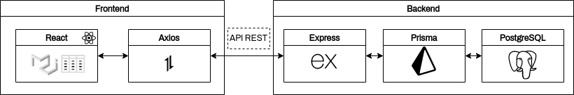
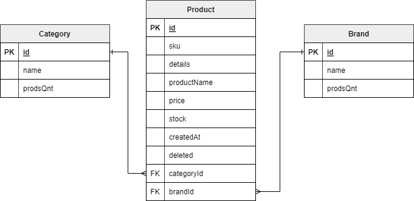

# Mini PERN project

Simple React component using [MUI-Datatables](https://github.com/gregnb/mui-datatables), with CRUD requests using PERN stack.

## Description

This project is a simple CRUD application using the PERN stack (PostgreSQL, Express, React, Node.js).

The backend is a REST API built with Node.js and Express, using Prisma as ORM to connect to the PostgreSQL database.

The frontend is a React application built with Vite, using Material-UI and MUI-Datatables for the UI.

The project is containerized using Docker and Docker Compose, for frontend, backend and database, and interacts as follows:



For the database, the following model was used:



Also I've created a [public collection](https://postman.com/jhordyess/workspace/mini-pern/documentation/20955361-cbb1019b-d7d1-4b8d-9b86-384d48f171fa) for this project in Postman, that you can use to test the API. Note that you need to have the backend running in order to use it.

### Technologies Used

#### Backend

- JS libraries: [Express](http://expressjs.com/), [Prisma](https://www.prisma.io/)
- Server environment: [Node.js](https://nodejs.org/en/)

#### Frontend

- JS libraries: [React](https://reactjs.org/), [Material-UI](https://mui.com/), [MUI-Datatables](https://github.com/gregnb/mui-datatables), [Axios](https://axios-http.com/)
- Build tool: [Vite](https://vitejs.dev/)
- Web Server: [Nginx](https://www.nginx.com/)

#### Others

- Database: [PostgreSQL](https://www.postgresql.org/)
- Containerization: [Docker](https://www.docker.com/)
- Dev Environment: [VSCode](https://code.visualstudio.com/) with [dev containers](https://code.visualstudio.com/docs/remote/containers) in [Zorin OS](https://zorinos.com/)

### Screenshots


## How to use for development

You can use the VSCode dev containers to run the project in a containerized environment.

You need to have installed [Docker](https://www.docker.com/) and [VSCode](https://code.visualstudio.com/), and the [Dev Containers](https://marketplace.visualstudio.com/items?itemName=ms-vscode-remote.remote-containers) extension.

1. Clone this repository

```bash
git clone git@github.com:jhordyess/mini-pern.git
```

2. Open the project in VSCode

```bash
code mini-pern
```

3. Create a `.env` file in the root folder by copying the example from the [`.env.example`](./.env.example) file.

4. Open the integrated terminal (Ctrl+Shift+`) and run the following command:

```bash
docker compose -f docker-compose.dev.yml up -d
```

5. Open the command palette (Ctrl+Shift+P) and select the option `Dev Containers: Open folder in Container`.

6. Select the folder `backend` and wait for the container to be built.

7. Open the integrated terminal (Ctrl+Shift+`) and run the following command:

```bash
yarn dev
```

8. Repeat the steps 5, 6 and 7 for the folder `frontend`.

9. Open the browser and visit <http://localhost:5173/> and lets code!

## How to use for production

To run the project in production mode, remember to create the `.env` file in the root folder by copying the example from the [`.env.example`](./.env.example) file.

Then, run the following command:

```bash
docker compose -f docker-compose.prod.yml up -d
```

To stop or remove the containers, use the following commands:

```bash
docker compose -f docker-compose.prod.yml down
```

Take note that this production configuration is just for testing purposes, and maybe need some changes to be used in a real production environment.

## To-Do

- Add more to-do's 😅

## Contribution

If you would like to contribute to the project, open an issue or make a pull request on the repository.

## License

© 2022> [Jhordyess](https://github.com/jhordyess). Under the [MIT](https://choosealicense.com/licenses/mit/) license. See the [LICENSE](./LICENSE) file for more details.

---

Made with 💪 by [Jhordyess](https://www.jhordyess.com/)
